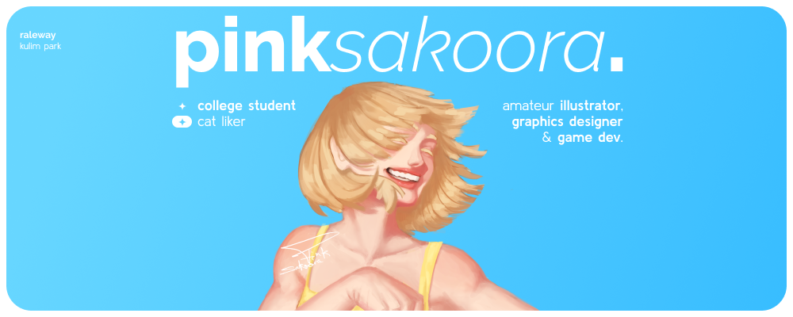

  
---
  
- College student, artist, and game developer. Learning app development on the side.  
- I dabble in graphics design for fun, and have designed a few T-shirts and posters. I also play the piano \(though I'm not very proficient at it.\)  
- Linux is fun \(and a humongous time sink T~T\)

  
- __[sakoora.dots](https://github.com/pinkSakoora/sakoora.dots)__: My Hyprland configuration.
- __[runner](https://github.com/pinkSakoora/runner)__: Source code for [Phase](https://pinksakoora.itch.io/phase), my 2D sidescroller prototype built in Unity.
- __[pong](https://github.com/pinkSakoora/Pong-)__: Source code for [Pong\!](https://pinksakoora.itch.io/pong), a stylized Pong game built in Unity as my first project.

  
- __[itch.io](https://pinksakoora.itch.io)__: Hosts my games.
- __[Instagram](https://www.instagram.com/pinksakoora)__: Features most of my artworks and posters.
